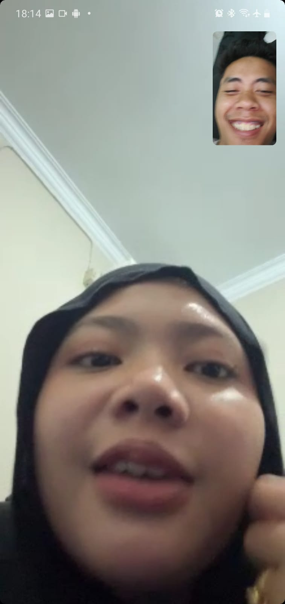
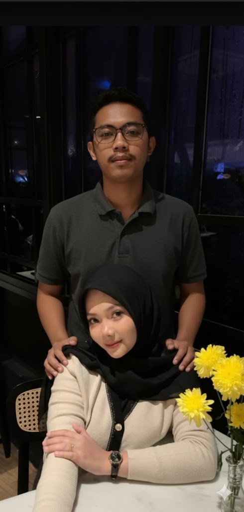
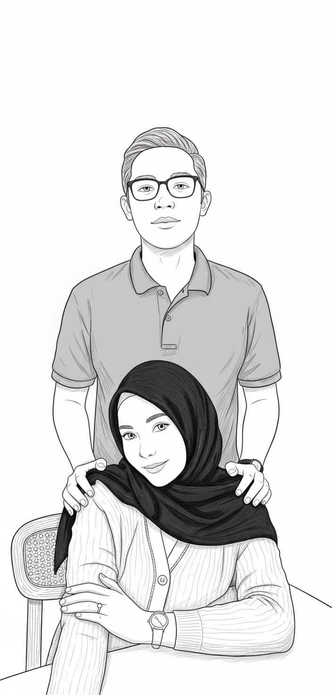

<html lang="id">
<head>
    <meta charset="UTF-8">
    <meta name="viewport" content="width=device-width, initial-scale=1.0">
    <title>Halo Dwi Safitri,-</title>
    
    <link href="https://fonts.googleapis.com/css2?family=Poppins:wght@400;700&family=Pacifico&display=swap" rel="stylesheet">
    <link rel="stylesheet" href="https://cdnjs.cloudflare.com/ajax/libs/font-awesome/6.0.0-beta3/css/all.min.css">
    <link rel="stylesheet" href="https://cdnjs.cloudflare.com/ajax/libs/animate.css/4.1.1/animate.min.css"/>
    
    
</head>
<body>
    <audio id="background-music" loop>
        <source src="lagu1.mp3" type="audio/mp3">
        Your browser does not support the audio element.
    </audio>

    

        
Halo Dwi Safitrikuu!

        
Nama Kamu Biar bisalanjat:

        <input type="text" id="userName" placeholder="*Nama Lengkap" style="padding: 12px; font-size: 1.1em; border-radius: 8px; border: 1px solid #ffabab; width: calc(100% - 24px); box-sizing: border-box; margin-bottom: 15px;">
        <button class="start-btn animate__animated animate__bounceIn" onclick="startExperience()">Start <i class="fas fa-play"></i></button>
        
Dibuat Oleh PT. Inspirasi Cemerlang Indonesia (Andi Irfan Maulana) | All Rights reserved

    

    

        

            
            

                
Untukmu yang Berbahagia, !

                

                    Setelah sekian banyak 'Telepat' yang terasa hampa, aku sempat berpikir mungkin pencarian ini harus kuakhiri. Lalu kamu muncul. Entah kenapa, di tengah lelahnya hati, saat mendengarmu berbicara itu seperti janji kecil yang tak terucapkan. Jadi, dengan sisa keberanian yang ada, aku meminta user igmu. Semoga kali ini, 'telepat' ini bukan sekadar algoritma, tapi awal dari cerita yang dulu sempat hilang keyakinannya.
                

                
❤️

                

                    
                

                
With all my hopes, Andi Irfan Maulana

                <button class="next-btn animate__animated" onclick="nextSlide()">Next <i class="fas fa-arrow-right"></i></button>
            

            

                
Mulai Mengenalmu

                

                    "Hai,
Setelah semua obrolan panjang kita, dari yang sekadar 'telepati' di aplikasi ini, berlanjut ke tukar-menukar cerita di Instagram, bahkan sampai malam-malam penuh tawa dan keheningan dalam sleep call... aku pikir kita sudah lebih dari sekadar kenalan.
Saat aku meminta TikTok atau bahkan nomor WhatsApp-mu, itu bukan karena terburu-buru, tapi karena aku ingin semua 'dunia' kita terhubung. Aku ingin kamu tahu, betapa berharganya setiap detik yang kita habiskan bersama—betapa langkah kecil itu terasa seperti lompatan besar dalam hidupku yang sepi.
                

                
💖

                

                    
                

                
Forever yours, Dwi Safitrikuu

                <button class="next-btn animate__animated" onclick="nextSlide()">Next <i class="fas fa-arrow-right"></i></button>
            

            
            

                
Mulai Mengenalmu Part 2

                

                    Kamu bukan hanya sekadar obrolan di layar. Kamu adalah alasan aku tersenyum sebelum tidur dan alasan aku bersemangat bangun di pagi hari. Setiap cerita darimu, baik tentang hari yang melelahkan atau mimpi-mimpi kecilmu, semuanya terasa penting. Aku merasa kita membangun sesuatu yang nyata, di tengah dunia maya yang seringkali menipu. Aku ingin terus mengenalmu, bukan hanya sebagai 'teman sleep call', tapi sebagai bagian utuh dari masa depanku.
                

                
✨

                

                    
                

                
With all my heart, Andi Irfan Maulana

                <button class="next-btn animate__animated" onclick="nextSlide()">Next <i class="fas fa-arrow-right"></i></button>
            

            
            

                
Lanjutkan Cerita Kita

                

                    Kini, semua yang telah kita lalui—tawa, sedikit salah paham, hingga rencana-rencana kecil yang kita rajut—telah mengantarkanku pada satu keyakinan: Aku ingin menjadikan semua ini lebih dari sekadar kenangan. Aku ingin menjagamu, dan melihatmu bertumbuh bersamaku. Aku tahu mungkin ini terlalu cepat, tapi saat bersamamu, waktu terasa berhenti. Terima kasih sudah menjadi kejutan terbaik dalam hidupku, Dwi.
                

                
🥂

                

                    
                

                
Always thinking of you, Dwi Safitrikuu

                <button class="next-btn send-btn animate__animated" onclick="sendGiftRequest()">Hubungi Aku Sekarang (WA) <i class="fab fa-whatsapp"></i></button>
            

            

        

    
</body>
</html>
